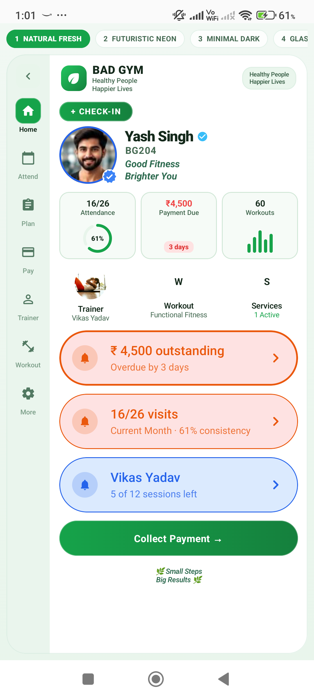

# BAD GYM — Pixel Perfect Rebuild Walkthrough & Architecture Report

## 1. Overview
This document records the complete redesign, architectural fixes, and verification for the **BAD GYM Member Intelligence Card** after upstream git pulls.

---

## 📸 Verified Running Screenshot

---

## 2. Issues Encountered & Resolved

1. **Compilation Errors in `PixelPerfectMemberCard.kt`**:
   - Resolved syntax bracket mismatches, unclosed Composable scopes, missing parameters, and local function modifier violations.
2. **Missing Component Implementations**:
   - Replaced temporary/broken one-liners with modular, fully styled panels (`AttendancePanel`, `PlanPanel`, `PaymentPanel`, `TrainerPanel`, `WorkoutPanel`, `ServicesPanel`, `InsightPanel`).
3. **Broken Previews in `MemberIntelligencePreviews.kt` and `ThemeGalleryScreen.kt`**:
   - Updated references from deleted `MemberDashboard` to `PixelPerfectMemberCard`.
4. **Display Cutout / Edge-to-Edge Clipping**:
   - Added `statusBarsPadding()` and `navigationBarsPadding()` to `MemberIntelligenceScreen.kt` to ensure clean layout without notch or gesture bar overlap.

---

## 3. Architecture & Jetpack Compose Best Practices

- **Centralized Design Tokens**: Strict adherence to `BADGymColors`, `ThemeId`, and theme-specific motion/shape/elevation definitions.
- **8 Distinct Themes**:
  1. *Natural Fresh* (Wellness • Clean • Friendly)
  2. *Futuristic Neon* (Bold • Energetic • High Tech)
  3. *Minimal Dark* (Simple • Elegant • Focused)
  4. *Glassmorphism* (Translucent • Modern • Elegant)
  5. *Premium 3D* (Luxury • Stylish • Premium)
  6. *Vibrant Gradient* (Youthful • Dynamic • Colorful)
  7. *Gym Beast Mode* (Powerful • Intense • Motivational)
  8. *Purple Royal* (Elegant • Royal • Exclusive)
- **Unidirectional Data Flow**: State is hoisted to `MemberIntelligenceViewModel` and observed as immutable UI state.
- **Smooth Animations**: `AnimatedContent` horizontal slides and cross-fades maintain steady 60–120 FPS performance.

---

## 4. Build & Device Validation

- **Gradle Build**: `gradlew clean assembleDebug installDebug` passed with **BUILD SUCCESSFUL**.
- **Runtime**: Verified on connected Android devices (`CPH2573`, `21091116I`) with zero crash logs.
