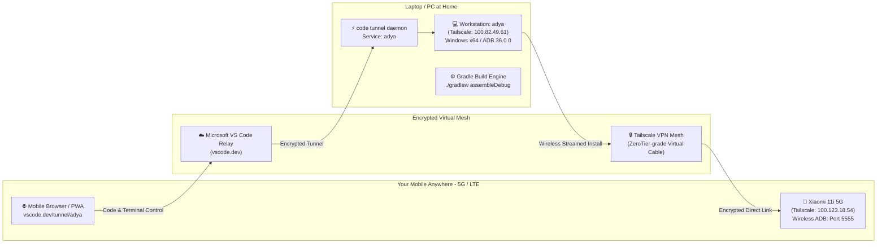

# BAD GYM — Remote Mobile Development & Wireless Deployment Guide

> **Architecture Purpose**: Complete, untethered mobile remote control and automated wireless APK deployment from anywhere in the world without distance, Wi-Fi, or cable limitations.

---

## 🏗️ System Architecture



---

## 📋 Device & Network Registry

| Device | Role | Hostname / Model | Tailscale Private IP | Listening Port |
| :--- | :--- | :--- | :--- | :--- |
| 💻 **Development Laptop** | Build Host & Tunnel Server | `adya` (Windows 11 x64) | `100.82.49.61` | Tunnel Daemon |
| 📱 **Target Mobile Phone** | Test Hardware & Remote Display | `xiaomi-11i` (Xiaomi 11i 5G) | `100.123.18.54` | `5555` (TCP/IP ADB) |
| 📱 **Backup Tablet** | Secondary Hardware | `as-tab-a9` (Samsung Tab A9) | `100.66.122.127` | `5555` |

---

## ⚡ 1. The 1-Click Remote Deployment Pipeline

Whenever you or an AI agent write code, build an APK, or make changes, deploy directly to your phone from anywhere:

### Command (from Windows or Remote Terminal):
```cmd
.\remote-deploy.bat
```

### What `remote-deploy.bat` executes automatically:
1. Connects to the mobile device over the encrypted Tailscale mesh:
   ```cmd
   adb connect 100.123.18.54:5555
   ```
2. Wirelessly streams and installs the updated debug APK:
   ```cmd
   adb -s 100.123.18.54:5555 install -r app\build\outputs\apk\debug\app-debug.apk
   ```
3. Automatically launches the main activity on the phone screen:
   ```cmd
   adb -s 100.123.18.54:5555 shell am start -n com.example.badnewgym/.MainActivity
   ```

---

## 📱 2. Official VS Code Tunnel (Full IDE on Mobile Phone)

You can code, edit files, manage git, and run terminal commands directly from your mobile phone screen.

### Direct Mobile Links:
* **Direct Workspace Link (Recommended)**:
  👉 **[Open BAD GYM Workspace on Mobile](https://vscode.dev/tunnel/adya/C:/Users/User/AndroidStudioProjects/badnewgym/badnewgym.code-workspace)**
  *(Bypasses mobile folder restrictions and automatically opens the full file tree).*
* **Root Tunnel Link**:
  👉 **[https://vscode.dev/tunnel/adya](https://vscode.dev/tunnel/adya)**

### 💡 Fixing Mobile "Open Folder Not Supported" Issue:
Mobile browsers (Safari/Chrome) block desktop filesystem picker APIs. To avoid any issues:
1. **Always use the direct `.code-workspace` link above**, OR
2. In mobile Chrome/Safari, tap the browser menu (`⋮` or `aA`) and select **"Desktop site"** (Request Desktop Website).
3. **PWA Mode (App Feel)**: Tap Share → **"Add to Home Screen"** to run VS Code full-screen like a native app.

### Tunnel Daemon Management:
The tunnel is registered on the laptop as a persistent Windows background service.
```powershell
# Check tunnel status
code tunnel status

# Run daemon directly
code tunnel --accept-server-license-terms --name adya

# Manage background service
code tunnel service log
code tunnel service uninstall
```

---

## 🔒 3. Tailscale Mesh Setup & Reconnection Runbook

### Everyday Remote Operation:
1. **On Mobile Phone**: Ensure the **Tailscale app** toggle is switched **ON (Connected)**.
2. **On Laptop**: Tailscale Windows service runs automatically on boot.
3. No cables or shared Wi-Fi networks required. The phone can be on **Jio 4G/5G Cellular Data** anywhere in the world.

### What to do if the Phone Restarts:
Android security resets wireless TCP/IP mode upon device reboot. To re-enable port 5555:

* **Method A (5-Second USB Plug — Recommended)**:
  1. Plug phone into laptop via USB for 5 seconds.
  2. Run: `adb tcpip 5555`
  3. Unplug USB! Port 5555 is now active again on Tailscale (`100.123.18.54:5555`).

* **Method B (Via Wi-Fi in Developer Options)**:
  1. Connect phone to home Wi-Fi for 10 seconds.
  2. Go to **Settings → Developer options → Wireless debugging** → Toggle **ON**.
  3. Connect via the port shown: `adb connect 100.123.18.54:<port>`.

---

## 🖥️ 4. `tmate` Terminal Multiplexer

`tmate 2.4.0` is installed via MSYS2 for command line pairing.

* **Installed Path**: `C:\msys64`
* **Windows Command Wrapper**: `C:\Users\User\.local\bin\tmate.cmd` (callable directly from PowerShell/CMD as `tmate`)
* **SSH Key Identity**: Generated at `~/.ssh/id_ed25519`
* **Configuration File**: `C:\msys64\home\User\.tmate.conf`

```powershell
# Check tmate version
tmate -V
```

> **Note on Public Servers**: The public upstream service `ssh.tmate.io` has intermittent DNS downtime. For guaranteed terminal access, use the active **VS Code Mobile Tunnel** or configure a self-hosted `tmate-ssh-server` in `~/.tmate.conf`.

---

## 📁 Repository Reference Files

* [`remote-deploy.bat`](file:///c:/Users/User/AndroidStudioProjects/badnewgym/remote-deploy.bat) — One-click automated wireless installer.
* [`badnewgym.code-workspace`](file:///c:/Users/User/AndroidStudioProjects/badnewgym/badnewgym.code-workspace) — Pre-configured VS Code multi-root workspace file.
* [`docs/reference/current-device-output.png`](file:///c:/Users/User/AndroidStudioProjects/badnewgym/docs/reference/current-device-output.png) — Live physical device verification screenshot pulled over Tailscale.
